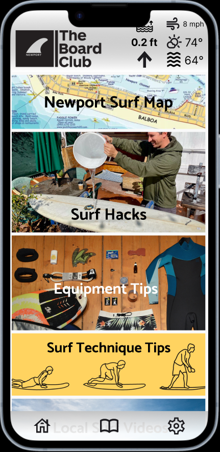
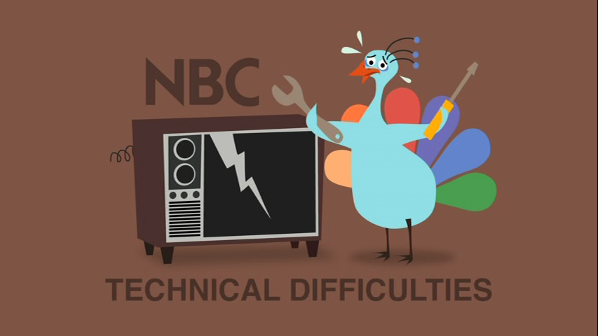

<h1>The Board Club App</h1>
 

  
<h4>An application designed to allow members of the board club to view boards, events, rental information, and general information about the club.</h4>

 
 

## Table-of-Contents

* [Deployment](#deployment)
* [Goal](#description)
* [Features](#features)
* [Installation](#installation)
* [Wireframe](#wireframe)
* [Technology](#technology)
* [Demo](#demo)

 

## [Goals](#table-of-contents)

The goal of this application to make members want to go surf by providing them with the all the infomation they need to have a great suf session. While also enticing members to try new surfboards and also feel apart of **The Board Club** community though local events and online interaction. Learning to surf is a time consuming and difficult task and this application aims to help beginners get the relevent information to make the right decision on equipment, location, and techniqe to help drive improvement with each session and to have a sense of communutity while they imbark on this difficult challenge.

 
 

## [Features](#table-of-contents)

 

* ~~Surfboard Database :surfer:~~
  * ~~Description~~
  * ~~Specs~~
  * ~~MFG Link~~
  * ~~Photos~~
  * ~~Comments/Feedback~~
  * ~~Rating~~

 

* Rental Infromation 🧾
  * Equipment
  * Prices / Hours

 

* Events Page :confetti_ball:
  * Upcoming Events
  * Previous Events
  * Calender View

 

* About :question:
  * General Club Info
  * Shaper Info/Links/Deals
  * Club Press

 

* Surf Diary :open_book:
  * :building_construction: **Flush Out Feature Set...**  :building_construction:

 

* Live WX :partly_sunny:
  * Water Temp
  * Tempeture
  * Wind
  * Sky Conditions
  * Popup/Overlay Widget

 

* Surf Resources :open_book:
  * Beginner Videos
  * Equipment Tips
  * Local Surf Spots Beta
  * Newport Surf Map

 

* Push Notification :loudspeaker:
  * Surfboard Overdue
  * New Surfboards
  * Upcoming Events
  * Swell / Conditions
 
 
 

## [Installation](#table-of-contents)

 
 

## [Wireframe](#table-of-contents)

 

  
  
<strong>Home Page</strong>

 
 

 

  
  
<strong>Club Events</strong>

 
 

 

  
  
<strong>Surf Log</strong>

 
 

 

  
  
<strong>Rental Page</strong>

 
 

 

  
  
<strong>Surf Knowledge</strong>

 
 

 

  
  
<strong>About Page</strong>

 
 

## [Technology](#table-of-contents)

* <h3> Software Stack </h3>

  * **Databases**
    * SQL (relational)
      * Surfboards
      * Events

    * MongoDB (non-relational)
      * User

 

  * **Server** (Node 18.6.0)
    * Packages
      * Package 1
      * Package 2
      * Package 3
      * Package 4
 

  * **Client** (React 18.2.0)
    * Packages
      * Package 1
      * Package 2
      * Package 3
      * Package 4

 

* <h3> Hardware/Deploy </h3>

  * Railway (Databases)
  * Back4App (Host)
  * Version Control (gitHub)

 
 

## [Demo](#table-of-contents)

 

  

 
 