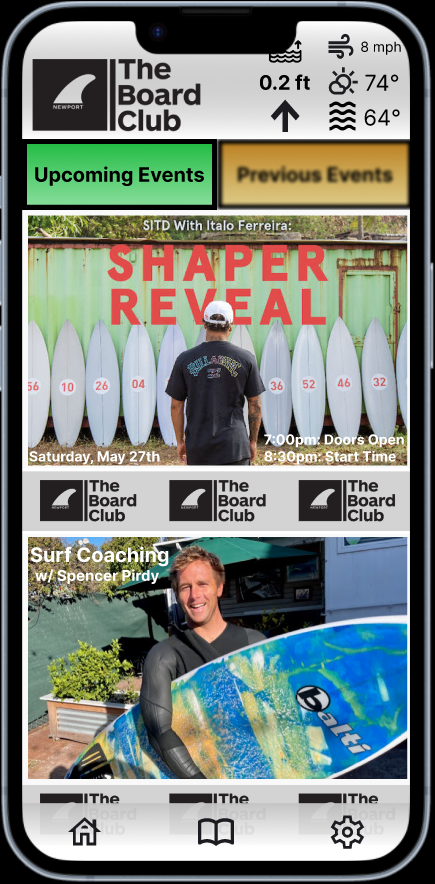

<h1>The Board Club App</h1>
 

  
<h4>An application designed to allow members of the board club to view boards, events, rental information, and general information about the club.</h4>

 
 

## Table-of-Contents

* [Deployment](#deployment)
* [Goal](#description)
* [Features](#features)
* [Installation](#installation)
* [Wireframe](#wireframe)
* [Technology](#technology)
* [Demo](#demo)

 

## [Goals](#table-of-contents)

The goal of this application to make members want to go surf by providing them with the all the infomation they need to have a great surf session. The app easily shows the current surf and weather conditons. Events are displayed to make it easy for memebers to get information they need to attend upcoming events. The Surf Log allow memebers to keep a log of all their surf sessions to track their progression and review previous sessions when selecting a surf spot or board for their next session. Surf hacks are listed to help new members with common surf problems. The Newport Surf map helps members easily pick the best spot to go surfing while visiting the club house based on  a variety of factors and conditions. The comminity forum helps memebers find other memebrs to surf with and also to interact memebers to build a sense of community.

 
 

## [Features](#table-of-contents)

 

* ~~Surfboard Database :surfer:~~
  * ~~Description~~
  * ~~Specs~~
  * ~~MFG Link~~
  * ~~Photos~~
  * ~~Comments/Feedback~~
  * ~~Rating~~

 

* Rental Infromation 🧾
  * Equipment
  * Prices / Hours

 

* Events Page :confetti_ball:
  * Upcoming Events
  * Previous Events
  * Calender View

 

* About :question:
  * General Club Info
  * ~~Shaper Info/Links/Deals~~
  * ~~Club Press~~

 

* Surf Diary :open_book:
  * Log Each Surf Session
  * Review previous surf Sessions
  * Track surf progression

 

* Live WX :partly_sunny:
  * Water Temp
  * Tempeture
  * Wind
  * Sky Conditions
  * Popup/Overlay Widget

 

* Surf Resources :open_book:
  * ~~Beginner Videos~~
  * ~~Equipment Tips~~
  * Surf Hacks
  * Local Surf Spots Beta
  * Newport Surf Map

 

* Push Notification :loudspeaker:
  * Surfboard Overdue
  * New Surfboards
  * Upcoming Events
  * Swell / Conditions
 
 
 

## [Installation](#table-of-contents)

 
 

## [Wireframe](#table-of-contents)

 

  
  
<strong>Home Page</strong>

 
 

 

  
  
<strong>Club Events</strong>

 
 

 

  
  
<strong>Surf Log</strong>

 
 

 

  
  
<strong>Rental Page</strong>

 
 

 

  
  
<strong>Surf Knowledge</strong>

 
 

 

  
  
<strong>About Page</strong>

 
 

## [Technology](#table-of-contents)

* <h3> Software Stack </h3>

 * **Databases**
   * MongoDB (non-relational)
      * User
      * Events
      * Surf Sessions
      * Surf Hacks
      * Surfboard Shapers

 

  * **Server** (Node 18.6.0)
    * Packages
      * @apollo/server (4.7.4)
      * @aws-sdk/credential-providers (3.369.0)
      * @aws-sdk/hash-node (3.369.0)
      * @aws-sdk/protocol-http (3.369.0)
      * @aws-sdk/s3-request-presigner (3.369.0)
      * @aws-sdk/url-parser (3.369.0)
      * @aws-sdk/util-format-url(3.369.0)
      * aws-sdk (2.1414.0)
      * bcrypt (5.1.0)
      * body-parser (1.20.2)
      * cors (2.8.5)
      * dotenv (16.3.1)
      * express (4.18.2)
      * graphql (16.6.0)
      * graphql-http (1.19.0)
      * json (11.0.0)
      * jsonwebtoken (9.0.0)
      * mongodb (5.6.0)
      * mongoose (7.3.0)
      * node-fetch (2.6.11)
      * react (18.2.0)
      * ~~ sequelize (6.32.1)~~
      * ~~ sqlite3 (5.1.6)~~
 

  * **Client** (React 18.2.0)
    * Packages
      * Package 1
      * Package 2
      * Package 3
      * Package 4

 

* <h3> Hardware/Deploy </h3>

  * Railway (Databases)
  * Back4App (Host)
  * Version Control (gitHub)
  * AWS (S3)

 
 

## [Demo](#table-of-contents)

 

  

 
 